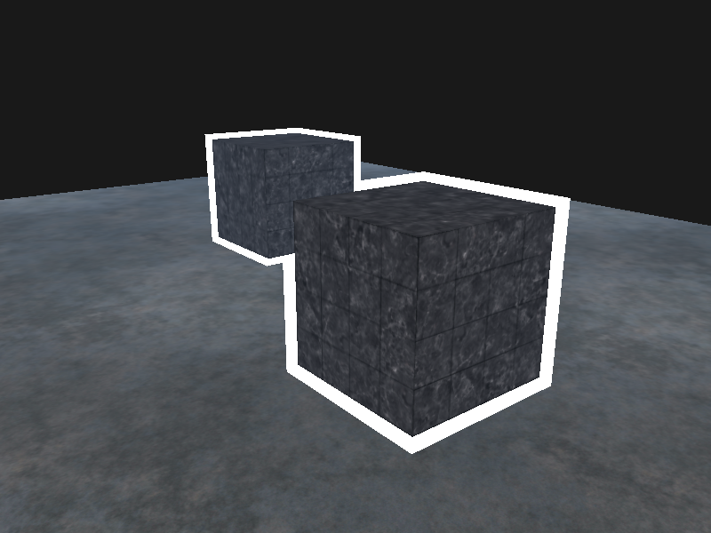

```c++
glStencilMask(0xFF); // 每一位写入模板缓冲时都保持原样
glStencilMask(0x00); // 每一位在写入模板缓冲时都会变成0（禁用写入）
```




<hr/>
glStencilFunc(GLenum func, GLint ref, GLuint mask)一共包含三个参数：

- `func`：设置模板测试函数(Stencil Test Function)。这个测试函数将会应用到已储存的模板值上和glStencilFunc函数的`ref`值上。可用的选项有：GL_NEVER、GL_LESS、GL_LEQUAL、GL_GREATER、GL_GEQUAL、GL_EQUAL、GL_NOTEQUAL和GL_ALWAYS。它们的语义和深度缓冲的函数类似。
- `ref`：设置了模板测试的参考值(Reference Value)。模板缓冲的内容将会与这个值进行比较。
- `mask`：设置一个掩码，它将会与参考值和储存的模板值在测试比较它们之前进行与(AND)运算。初始情况下所有位都为1。

<hr/>
glStencilOp(GLenum sfail, GLenum dpfail, GLenum dppass)一共包含三个选项，我们能够设定每个选项应该采取的行为：

- `sfail`：模板测试失败时采取的行为。
- `dpfail`：模板测试通过，但深度测试失败时采取的行为。
- `dppass`：模板测试和深度测试都通过时采取的行为。

每个选项都可以选用以下的其中一种行为：

| 行为         | 描述                                               |
| :----------- | :------------------------------------------------- |
| GL_KEEP      | 保持当前储存的模板值                               |
| GL_ZERO      | 将模板值设置为0                                    |
| GL_REPLACE   | 将模板值设置为glStencilFunc函数设置的`ref`值       |
| GL_INCR      | 如果模板值小于最大值则将模板值加1                  |
| GL_INCR_WRAP | 与GL_INCR一样，但如果模板值超过了最大值则归零      |
| GL_DECR      | 如果模板值大于最小值则将模板值减1                  |
| GL_DECR_WRAP | 与GL_DECR一样，但如果模板值小于0则将其设置为最大值 |
| GL_INVERT    | 按位翻转当前的模板缓冲值                           |

<hr/>
### 脑子遇到的坑

#### 清空缓冲前检查膜版掩码是否为0xff

```c++
glStencilMask(0xFF);  // important
glClear(GL_COLOR_BUFFER_BIT | GL_DEPTH_BUFFER_BIT | GL_STENCIL_BUFFER_BIT);
```

#### 别忘了全局的一些选项

```c++
// configure global opengl state
glEnable(GL_DEPTH_TEST);
glDepthFunc(GL_LESS);
glEnable(GL_STENCIL_TEST);
glStencilFunc(GL_NOTEQUAL, 1, 0xFF);
glStencilOp(GL_KEEP, GL_KEEP, GL_REPLACE);// 使用替换规则
```

<hr/>
应该还是有shader实现描边的。

参见崩崩崩的精细描边。

由于这个方法使通过放大模型来达到包边的效果，需要画两次。有没有什么神仙方法通过法线实现？自己实现的法线会在一些曲率不高的边缘产生厚描边。

同时也有头发这种东西需要处理。

但是需要精细描边的基本上都是NPR，头发都变一大块叻。