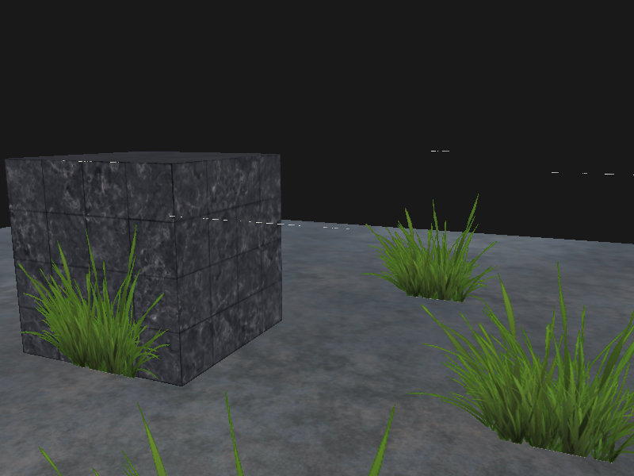
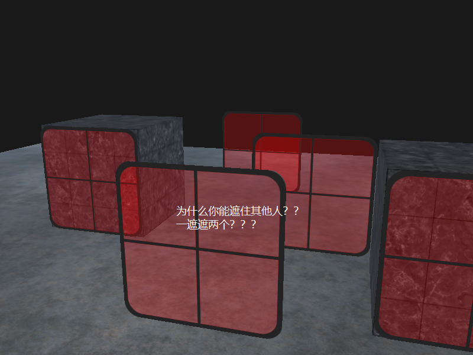
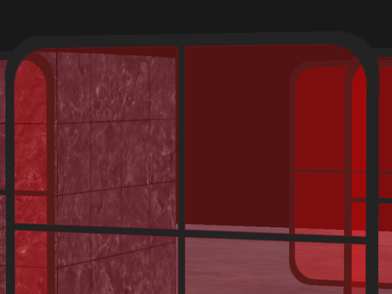

$$
\begin{equation}\bar{C}_{result} = \bar{\color{green}C}_{source} * \color{green}F_{source} + \bar{\color{red}C}_{destination} * \color{red}F_{destination}\end{equation}
$$

虽然直接丢弃片段很好，但它不能让我们渲染半透明的图像。我们要么渲染一个片段，要么完全丢弃它。要想渲染有多个透明度级别的图像，我们需要启用混合(Blending)。和OpenGL大多数的功能一样，我们可以启用GL_BLEND来启用混合：

```c
glEnable(GL_BLEND);
```

`glBlendFunc(GLenum sfactor, GLenum dfactor)`函数接受两个参数，来设置源和目标因子。

为了获得之前两个方形的混合结果，我们需要使用源颜色向量的alpha作为源因子，使用1−alpha作为目标因子。这将会产生以下的`glBlendFunc`：

```
glBlendFunc(GL_SRC_ALPHA, GL_ONE_MINUS_SRC_ALPHA);
```

也可以使用`glBlendFuncSeparate`为RGB和alpha通道分别设置不同的选项：

```
glBlendFuncSeparate(GL_SRC_ALPHA, GL_ONE_MINUS_SRC_ALPHA, GL_ONE, GL_ZERO);
```

<hr/>

实操：

```c
glEnable(GL_BLEND);
glBlendFunc(GL_SRC_ALPHA, GL_ONE_MINUS_SRC_ALPHA);
```

加入这两行直接爽到。





### 顺序问题

要想让混合在多个物体上工作，我们需要最先绘制最远的物体，最后绘制最近的物体。普通不需要混合的物体仍然可以使用深度缓冲正常绘制，所以它们不需要排序。但我们仍要保证它们在绘制（排序的）透明物体之前已经绘制完毕了。当绘制一个有不透明和透明物体的场景的时候，大体的原则如下：

1. 先绘制所有不透明的物体。
2. 对所有透明的物体排序。
3. 按顺序绘制所有透明的物体。

